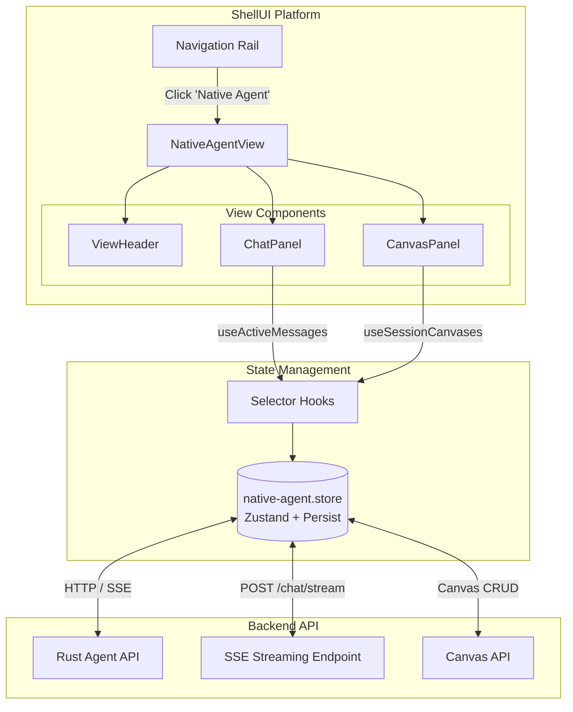
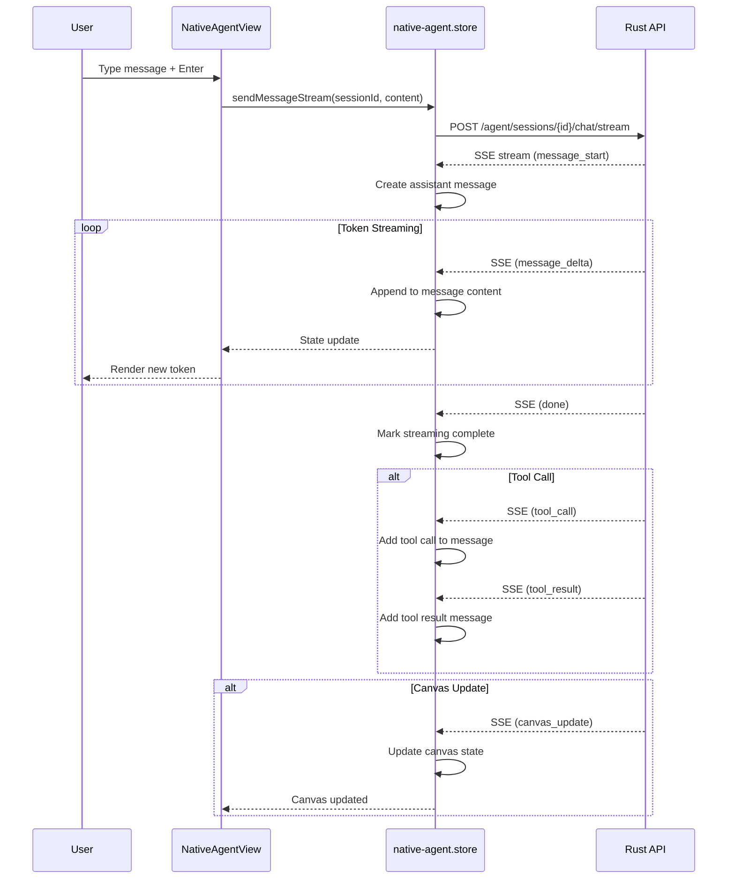

# N20 Native OpenClaw Agent

> **Feature Code:** N20  
> **Category:** AI Agent Interface  
> **Status:** Production Ready

---

## Table of Contents

1. [Overview](#overview)
2. [Architecture](#architecture)
3. [Quick Start](#quick-start)
4. [API Reference](#api-reference)
5. [Streaming Protocol](#streaming-protocol)
6. [Canvas System](#canvas-system)
7. [Development Guide](#development-guide)
8. [Troubleshooting](#troubleshooting)

---

## Overview

The **N20 Native OpenClaw Agent** is a first-class AI agent interface integrated directly into the A2rchitect ShellUI platform. Unlike external agent connections, the Native Agent provides:

- **Direct Integration**: Built into the core platform, no external dependencies
- **Streaming Responses**: Real-time token-by-token response streaming via Server-Sent Events (SSE)
- **Split-Pane Interface**: Simultaneous chat and canvas visualization
- **Session Management**: Persistent conversation history with CRUD operations
- **Tool Execution**: Visual representation of agent tool calls and results
- **Canvas Artifacts**: Code, documents, diagrams, and terminal outputs generated by the agent

### Key Features

| Feature | Description |
|---------|-------------|
| **Streaming Chat** | Real-time response generation with visual feedback |
| **Session Management** | Create, rename, delete, and switch between conversations |
| **Canvas System** | Visual artifacts for code, docs, diagrams, and terminal output |
| **Tool Visualization** | Expandable tool call and result displays |
| **View Modes** | Split, chat-only, and canvas-only layouts |
| **Persistent State** | Sessions and canvases survive page reloads |

---

## Architecture

### System Overview



### Data Flow



### Component Hierarchy

```
ShellUI
└── NativeAgentView
    ├── ViewHeader
    │   ├── Session Selector (Dropdown)
    │   ├── New Session Button
    │   ├── Delete Session Button
    │   └── View Mode Toggle
    ├── ErrorBanner
    └── PanelGroup (Resizable)
        ├── ChatPanel
        │   ├── ScrollArea (Messages)
        │   │   ├── EmptyChatState (when no messages)
        │   │   └── MessageItem[]
        │   │       ├── UserMessage
        │   │       ├── AssistantMessage
        │   │       │   └── ToolCallItem[] (expandable)
        │   │       └── ToolResultItem (expandable)
        │   └── InputArea
        │       ├── Textarea
        │       └── Send/Stop Button
        └── CanvasPanel
            ├── CanvasHeader
            │   └── Quick Create Buttons
            ├── EmptyCanvasState (when empty)
            └── CanvasList
                ├── CanvasListItem[]
                └── CanvasViewer
```

---

## Quick Start

### Accessing the Native Agent

1. **Open ShellUI**
   ```
   Navigate to the A2rchitect ShellUI platform
   ```

2. **Click "Native Agent" in the Navigation Rail**
   
   The Native Agent icon appears in the left navigation rail alongside other platform features.

3. **Create or Select a Session**
   
   - **New Session**: Click the `+` button next to the session dropdown
   - **Select Existing**: Use the dropdown to choose from previous sessions
   - **Delete**: Click the trash icon to remove the current session

4. **Send a Message**
   
   ```
   Type your message in the input box at the bottom
   Press Enter to send (Shift+Enter for new line)
   ```

5. **View Canvas Artifacts**
   
   - The right panel displays generated canvases
   - Switch view modes using the layout toggle button
   - Create manual canvases using the header buttons (Code, Doc, Terminal)

### First Conversation Example

```
┌─────────────────────────────────────────────────────────────────┐
│ 🤖 Native Agent          [Session ▼]  [+]  [🗑]  [Layout]        │
├──────────────────────────────┬──────────────────────────────────┤
│                              │  🎨 Canvas                    [0] │
│  Welcome to Native Agent     ├──────────────────────────────────┤
│                              │                                  │
│  ✨ Start a conversation     │  Canvas is empty                 │
│    with the N20 Native       │                                  │
│    OpenClaw Agent.           │  Create content or wait for      │
│                              │  the agent to generate artifacts │
│  [Tool Calls]  [Split View]  │                                  │
│                              │  [Code]  [Doc]  [Terminal]       │
├──────────────────────────────┴──────────────────────────────────┤
│  Type your message...                                    [Send] │
└─────────────────────────────────────────────────────────────────┘
```

### View Modes

| Mode | Icon | Description |
|------|------|-------------|
| **Split** | `<Layout />` | Chat and canvas side-by-side (default) |
| **Chat Only** | `<PanelLeft />` | Full-width chat panel |
| **Canvas Only** | `<PanelRight />` | Full-width canvas panel |

Toggle between modes by clicking the layout button in the header.

---

## API Reference

### Store Hooks

The `native-agent.store` exports convenient hooks for accessing state:

#### `useNativeAgentStore`

The main store hook providing full access to state and actions.

```typescript
import { useNativeAgentStore } from '@/lib/agents/native-agent.store';

function MyComponent() {
  const {
    // State
    sessions,
    activeSessionId,
    messages,
    tools,
    canvases,
    streaming,
    error,
    
    // Actions
    createSession,
    sendMessageStream,
    abortGeneration,
    fetchTools,
    createCanvas,
  } = useNativeAgentStore();
  
  // ...
}
```

#### `useActiveSession`

Returns the currently active session or `null`.

```typescript
import { useActiveSession } from '@/lib/agents/native-agent.store';

function SessionInfo() {
  const session = useActiveSession();
  
  if (!session) return <div>No active session</div>;
  
  return (
    <div>
      <h2>{session.name}</h2>
      <p>Created: {new Date(session.createdAt).toLocaleDateString()}</p>
      <p>Messages: {session.messageCount}</p>
    </div>
  );
}
```

**Return Type:** `NativeSession | null`

```typescript
interface NativeSession {
  id: string;
  name?: string;
  description?: string;
  createdAt: string;
  updatedAt: string;
  lastAccessedAt: string;
  messageCount: number;
  isActive: boolean;
  tags: string[];
  metadata?: Record<string, unknown>;
}
```

#### `useActiveMessages`

Returns messages for the currently active session.

```typescript
import { useActiveMessages } from '@/lib/agents/native-agent.store';

function MessageList() {
  const messages = useActiveMessages();
  
  return (
    <div>
      {messages.map(msg => (
        <div key={msg.id} className={msg.role}>
          {msg.content}
        </div>
      ))}
    </div>
  );
}
```

**Return Type:** `NativeMessage[]`

```typescript
interface NativeMessage {
  id: string;
  role: 'user' | 'assistant' | 'system' | 'tool';
  content: string;
  timestamp: string;
  metadata?: Record<string, unknown>;
  toolCalls?: ToolCall[];
  toolCallId?: string;  // Present for tool role messages
}
```

#### `useStreamingState`

Returns the current streaming status and buffer.

```typescript
import { useStreamingState } from '@/lib/agents/native-agent.store';

function StreamingIndicator() {
  const { isStreaming, error, buffer } = useStreamingState();
  
  if (error) return <div className="error">Error: {error}</div>;
  if (isStreaming) return <div>Generating... {buffer.length} chars</div>;
  return null;
}
```

**Return Type:**

```typescript
{
  isStreaming: boolean;
  error: string | null;
  buffer: string;  // Current accumulated content
}
```

#### `useSessionCanvases`

Returns all canvases for a specific session.

```typescript
import { useSessionCanvases } from '@/lib/agents/native-agent.store';

function CanvasGallery({ sessionId }: { sessionId: string }) {
  const canvases = useSessionCanvases(sessionId);
  
  return (
    <div className="gallery">
      {canvases.map(canvas => (
        <CanvasCard key={canvas.id} canvas={canvas} />
      ))}
    </div>
  );
}
```

**Return Type:** `Canvas[]`

```typescript
interface Canvas {
  id: string;
  sessionId: string;
  content: string;
  type: 'code' | 'markdown' | 'json' | 'text';
  language?: string;
  createdAt: string;
  updatedAt: string;
  metadata?: Record<string, unknown>;
}
```

### Store Actions

#### Session Management

```typescript
// Fetch all sessions
await fetchSessions();

// Create new session
const session = await createSession(name?: string, description?: string);

// Update session
await updateSession(sessionId, { name: 'New Name' });

// Delete session
await deleteSession(sessionId);

// Set active session
setActiveSession(sessionId);
```

#### Messaging

```typescript
// Send non-streaming message
await sendMessage(sessionId, content, role = 'user');

// Send streaming message (recommended)
await sendMessageStream(sessionId, content, onEvent?);

// Abort generation
await abortGeneration(sessionId?);
```

#### Tools

```typescript
// Fetch available tools
await fetchTools();

// Execute tool directly
const result = await executeTool(sessionId, toolName, parameters);
```

#### Canvas

```typescript
// Create canvas
const canvas = await createCanvas(sessionId, content, type, language?);

// Update canvas
await updateCanvas(canvasId, { content: 'new content' });

// Delete canvas
await deleteCanvas(canvasId);

// Fetch session canvases
await fetchSessionCanvases(sessionId);
```

---

## Streaming Protocol

The N20 Native Agent uses **Server-Sent Events (SSE)** for real-time streaming.

### Event Types

```typescript
type StreamEventType = 
  | 'message_start'    // New assistant message begins
  | 'message_delta'    // Token/chunk of content
  | 'message_complete' // Message finished
  | 'tool_call'        // Agent invoked a tool
  | 'tool_result'      // Tool execution completed
  | 'tool_error'       // Tool execution failed
  | 'canvas_update'    // Canvas content updated
  | 'error'            // Stream error
  | 'done';            // Stream complete
```

### Event Structure

```typescript
interface StreamEvent {
  type: StreamEventType;
  sessionId?: string;
  messageId?: string;
  delta?: {
    content?: string;
    reasoning?: string;
  };
  toolCall?: {
    id: string;
    name: string;
    arguments: Record<string, unknown>;
  };
  toolResult?: {
    toolCallId: string;
    result: unknown;
    error?: string;
  };
  canvas?: Canvas;
  error?: string;
  timestamp: string;
}
```

### SSE Format

```
data: {"type":"message_start","messageId":"msg_123","timestamp":"2024-..."}

data: {"type":"message_delta","delta":{"content":"Hello"},"timestamp":"..."}

data: {"type":"message_delta","delta":{"content":" world"},"timestamp":"..."}

data: {"type":"tool_call","toolCall":{"id":"call_1","name":"search","arguments":{"query":"..."}},"timestamp":"..."}

data: {"type":"tool_result","toolResult":{"toolCallId":"call_1","result":"..."},"timestamp":"..."}

data: {"type":"done","timestamp":"..."}

data: [DONE]
```

### Handling Events

```typescript
await sendMessageStream(sessionId, content, (event) => {
  switch (event.type) {
    case 'message_start':
      console.log('New message:', event.messageId);
      break;
    case 'tool_call':
      console.log('Tool called:', event.toolCall?.name);
      break;
    case 'canvas_update':
      console.log('Canvas updated:', event.canvas?.id);
      break;
    case 'error':
      console.error('Stream error:', event.error);
      break;
  }
});
```

### Aborting Streams

```typescript
// Client-side abort
const { abortGeneration } = useNativeAgentStore();
await abortGeneration();

// Or with specific session
await abortGeneration(sessionId);
```

The abort controller signals the fetch request to cancel, and also notifies the server via `POST /agent/sessions/{id}/abort`.

---

## Canvas System

### Canvas Types

| Type | Icon | Use Case |
|------|------|----------|
| `code` | `<Code />` | Source code snippets |
| `markdown` / `document` | `<FileText />` | Documentation, notes |
| `json` | - | Structured data |
| `text` | - | Plain text |
| `diagram` | `<Layout />` | Visual diagrams (SVG) |
| `visualization` | `<Image />` | Data visualizations |
| `terminal` | `<Terminal />` | Command output |

### Creating Canvases

**Via Store:**

```typescript
const canvas = await createCanvas(
  sessionId,
  '# Hello World',
  'markdown',
  undefined
);
```

**Via Stream Events:**

The AI can generate canvases during conversation:

```
data: {"type":"canvas_update","canvas":{"id":"can_1","type":"code","content":"..."}}
```

### Canvas State Structure

```typescript
// State shape
interface NativeAgentState {
  canvases: Record<string, Canvas>;        // canvasId -> Canvas
  sessionCanvases: Record<string, string[]>; // sessionId -> canvasIds[]
}
```

### Canvas Viewer Features

- **Edit**: In-place editing for code and document types
- **Copy**: Copy content to clipboard
- **Download**: Save as file with appropriate extension
- **Delete**: Remove canvas from session

### File Extensions

| Canvas Type | Extension |
|-------------|-----------|
| code | `.txt` |
| document | `.md` |
| diagram | `.svg` |
| visualization | `.json` |
| terminal | `.sh` |

---

## Development Guide

### Adding New Canvas Types

1. **Update Type Definition**

```typescript
// native-agent.store.ts
export interface Canvas {
  type: 'code' | 'markdown' | 'json' | 'text' | 'newtype'; // Add new type
}
```

2. **Add Icon Mapping**

```typescript
// NativeAgentView.tsx
const typeIcons: Record<Canvas['type'], typeof Code> = {
  // ... existing
  newtype: MyNewIcon,
};
```

3. **Add File Extension**

```typescript
function getFileExtension(type: Canvas['type']): string {
  switch (type) {
    // ... existing
    case 'newtype': return 'ext';
  }
}
```

4. **Add Viewer Component** (if needed)

```typescript
function CanvasViewer({ canvas }: CanvasViewerProps) {
  // ...
  if (canvas.type === 'newtype') {
    return <NewTypeViewer content={canvas.content} />;
  }
  // ...
}
```

### Custom Message Renderers

Extend message rendering for special content types:

```typescript
function MessageItem({ message }: MessageItemProps) {
  // Custom rendering based on metadata
  if (message.metadata?.renderType === 'special') {
    return <SpecialMessage content={message.content} />;
  }
  
  // Default rendering
  return <DefaultMessage message={message} />;
}
```

### Adding Session Features

```typescript
// Extend NativeSession interface
interface NativeSession {
  // ... existing fields
  customField?: string;
}

// Use in component
const session = useActiveSession();
const customValue = session?.customField;
```

### Event Source Connection

For server-push updates (alternative to polling):

```typescript
useEffect(() => {
  const cleanup = connectStream(sessionId, (event) => {
    console.log('Received:', event);
  });
  
  return cleanup; // Auto-disconnect on unmount
}, [sessionId]);
```

### Testing Store Actions

```typescript
import { useNativeAgentStore } from '@/lib/agents/native-agent.store';

// Reset store state between tests
beforeEach(() => {
  useNativeAgentStore.setState({
    sessions: [],
    activeSessionId: null,
    messages: {},
    error: null,
  });
});
```

---

## Troubleshooting

### Common Issues

#### Stream Not Starting

**Symptoms:** Send button spins but no response appears

**Solutions:**
1. Check network connection to API endpoint
2. Verify `API_BASE_URL` is configured correctly
3. Check browser console for CORS errors
4. Ensure session exists before sending message

```typescript
// Debug: Check session state
const { activeSessionId, error } = useNativeAgentStore();
console.log('Active session:', activeSessionId);
console.log('Store error:', error);
```

#### Canvas Not Updating

**Symptoms:** Agent claims to have created canvas but it's not visible

**Solutions:**
1. Verify `canvas_update` event is being received in SSE stream
2. Check `sessionCanvases` mapping includes the canvas ID
3. Ensure session ID in canvas matches active session

```typescript
// Debug: Check canvas state
const { canvases, sessionCanvases } = useNativeAgentStore();
console.log('All canvases:', canvases);
console.log('Session canvas IDs:', sessionCanvases[sessionId]);
```

#### Session Persistence Issues

**Symptoms:** Sessions disappear on page reload

**Solutions:**
1. Check Zustand persist middleware is working
2. Verify localStorage is not cleared
3. Check for storage quota exceeded errors

```typescript
// Persist configuration (default)
{
  name: 'native-agent-storage-v1',
  partialize: (state) => ({
    sessions: state.sessions,
    activeSessionId: state.activeSessionId,
    messages: state.messages,
    canvases: state.canvases,
    sessionCanvases: state.sessionCanvases,
  }),
}
```

#### Tool Calls Not Expanding

**Symptoms:** Tool calls appear but clicking doesn't expand

**Solutions:**
1. Verify `ToolCallItem` component receives proper `toolCall` prop
2. Check `toolCalls` array is populated in message object
3. Ensure event handler for expansion is attached

#### Streaming Stops Mid-Response

**Symptoms:** Response cuts off unexpectedly

**Solutions:**
1. Check for network interruptions
2. Verify server-side timeout settings
3. Check for large payload issues
4. Implement retry logic in `sendMessageStream`

### Error Codes

| Error | Cause | Solution |
|-------|-------|----------|
| `Failed to fetch sessions` | API unavailable | Check network, verify API is running |
| `Already streaming` | Concurrent request attempted | Wait for current stream to complete or abort |
| `No abort controller` | Race condition in state | Reset streaming state manually |
| `Stream failed` | Network or server error | Retry request, check server logs |
| `Tool execution failed` | Invalid tool parameters | Verify tool schema and arguments |

### Debug Mode

Enable Zustand devtools for state inspection:

```typescript
// In browser console with Redux DevTools installed
// Access store state
__ZUSTAND_STORE__.nativeAgentStore.getState()

// Subscribe to changes
__ZUSTAND_STORE__.nativeAgentStore.subscribe(console.log)
```

### Performance Tips

1. **Use selector hooks** instead of full store subscription
2. **Memoize expensive computations** in message rendering
3. **Virtualize long message lists** for sessions with 100+ messages
4. **Debounce rapid session switches** to prevent API thrashing

```typescript
// Good: Selector hook (only re-renders when active session changes)
const session = useActiveSession();

// Avoid: Full store subscription (re-renders on any state change)
const session = useNativeAgentStore(s => s.sessions.find(...));
```

---

## Related Documentation

- [ShellUI Architecture](./ARCHITECTURE.md)
- [Agent Service API](./AGENT-SERVICE.md)
- [Canvas System](./CANVAS.md)

---

*Last Updated: 2024*  
*Maintainer: A2rchitect UI Team*
