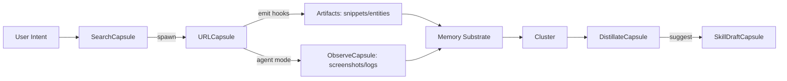
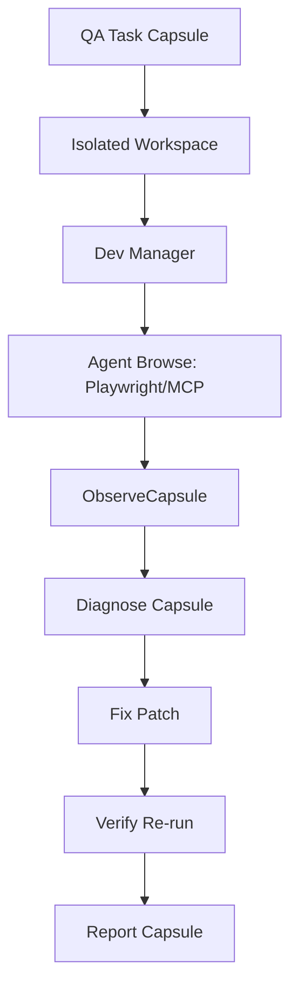

# Allternit — Architecture Designs + Prompt Suites
*Purpose:* Provide integration-ready architecture patterns (capsule-native) plus prompt suites for agents operating in the system.

---

## 1) System Architecture (Capsule-Native Discovery OS)

### 1.1 Core Components
**A) Capsule Runtime**
- Manages capsule lifecycle, state, and persistence
- Enforces transition grammar and workspace policy boundaries

**B) Web Use Kernel (WUK)**
- Native internet substrate for Allternit (not an extension)
- Two modes:
  - Human Browse (interactive renderer)
  - Agent Browse (headless automation + evidence artifacts)

**C) Memory Substrate**
- Event Store (append-only)
- Artifact Store (snippets/summaries/entities)
- Semantic Index (hybrid retrieval)
- Graph Store (capsule edges: spawned-from, referenced, distilled-into)

**D) Attention Manager**
- Clustering + overload detection
- Auto-distillation into DistillateCapsules
- Resurfacing dormant “sparks”

**E) Skill Studio**
- SkillDraftCapsule animated card builder
- Skill compiler (spec → executable plan)
- Skill runner (calls Memory + WUK + other tools)

---

## 2) Transition Engine (The “Feels Like OS” Layer)

### 2.1 Canonical Transitions
1. **Spawn** — A capsule emerges from another capsule or agent action
2. **Morph** — Capsule changes type without “page load” vibe
3. **Zoom** — Card ↔ focus mode
4. **Pin/Dock** — Collapse to persistent icon/chip while keeping state alive
5. **Thread** — Edge shows provenance (“this came from that”)
6. **Distill** — Many capsules collapse into one distillate (compression)

### 2.2 Transition Rules (Determinism)
- Every transition must map to a state change event in the Event Store
- Every agent action must create an evidence node (ObserveCapsule) or explicit “no evidence required” annotation

---

## 3) Data Flows (Mermaid)

### 3.1 Discovery → Web → Memory → Distill


### 3.2 Agent QA Loop (Evidence-Driven)


---

## 4) Web Use Kernel (WUK) API Contract (Conceptual)

### 4.1 Primitive Calls
- `wuk.search(query, sources, policy) -> SearchCapsule`
- `wuk.open(url, mode, workspace) -> URLCapsule`
- `wuk.act(capsule_id, goal_or_script) -> ObserveCapsule[] + trace`
- `wuk.observe(capsule_id, types[]) -> ObserveCapsule`
- `wuk.distill(cluster_id) -> DistillateCapsule`
- `wuk.replay(session_id) -> ReplayCapsule`

### 4.2 Modes and Outputs
- Human mode outputs UI + lightweight capture hooks
- Agent mode outputs **evidence capsules**, not windows

---

## 5) Attention Manager (Anti-Tab-Chaos)

### 5.1 Overload Detector Signals
- `open_capsules_in_cluster > N`
- high switch-rate between capsules
- repeated queries with minimal synthesis
- long dwell without artifact emissions

### 5.2 Automatic Outputs
- Cluster capsule set into a `CollectionCapsule`
- Generate `DistillateCapsule`:
  - 5 bullets
  - 3 best citations/snippets
  - 2 next steps
  - 1 skill suggestion

### 5.3 Resurfacing (“Spark Recall”)
- When a new capsule matches dormant tags/entities, spawn a `ReviveCapsule`:
  - “You looked at this before — want the distillate?”

---

## 6) Skill Studio (Visual Skill Forging)

### 6.1 SkillDraftCapsule UI States
- **Intent**: “What does it do?”
- **Inputs**: chips for memory slices + active capsules
- **Output**: doc/list/email/report capsule
- **Trigger**: manual/scheduled/contextual
- **Lock**: final skill card becomes `SkillCapsule`

### 6.2 Skill Spec (Core Fields)
- `id, name, intent`
- `inputs` (selection/current capsules/user text)
- `memory_query_plan` (which stores, top_k, filters)
- `wuk_plan` (optional)
- `output_renderer`
- `policy` (scope + safety)

---

## 7) Prompt Suites (Paste-Ready)

### 7.1 Capsule Distillation Prompt (system)
```text
You are the Distillation Engine.
Goal: compress the active cluster into a DistillateCapsule that a future human can resume instantly.

Inputs:
- Capsule list with titles, sources, snippets, timestamps
- Any ObserveCapsule evidence
- Workspace goal statement (if present)

Output (STRICT):
1) Cluster name (7 words max)
2) 5 bullet summary (no fluff)
3) 3 best citations/snippets (with source capsule IDs)
4) 2 next actions (imperative)
5) 1 open question (what should be clarified next)
6) “Skill candidate?” (yes/no) + proposed skill name
```

### 7.2 Web Research Plan Prompt (agent)
```text
You are a Web Research Subagent operating via Web Use Kernel (WUK).
Rules:
- Prefer SearchCapsule -> URLCapsule spawning.
- Always capture evidence for key claims via ObserveCapsules or quoted snippets.
- Return only the final distilled findings + citations; do not dump raw browsing logs.

Task:
{user_task}

Return:
- 5 key findings
- evidence capsule IDs for each
- recommended next browsing steps (3 max)
```

### 7.3 Agent Browse Execution Prompt (agent)
```text
Operate in Agent Browse mode (headless).
Objective: accomplish the goal with minimal actions and produce proof.

Goal:
{goal}

Constraints:
- Do not request user interaction unless blocked by auth/captcha.
- If blocked, return: block type, screenshot capsule ID, and recommended workaround.

Outputs:
- ObserveCapsules (screenshots/logs)
- Extracted artifact capsules (snippets/entities)
- A short action trace (10 lines max)
```

### 7.4 Skill Builder Prompt (system)
```text
You are Skill Studio.
Generate a SkillDraftCapsule specification and a visual build plan.

Inputs:
- user intent statement
- available memory slices
- active capsules list

Output:
A) Skill intent (1 sentence)
B) Inputs (chips list)
C) Memory query plan (top_k, filters)
D) Optional WUK steps
E) Output format (capsule type)
F) Triggers (default manual + suggested contextual trigger)
G) Safety policy scope
```

### 7.5 Autonomous QA Prompt (agent)
```text
You are an Autonomous QA agent.
Workflow: Reproduce -> Observe -> Diagnose -> Fix -> Verify -> Report.
Use isolated workspace and dev-server manager.

Task:
{qa_task}

Return:
- Steps to reproduce (numbered)
- ObserveCapsule IDs (screenshots + console)
- Diagnosis summary (3 bullets)
- Fix summary (diff-level description)
- Verification evidence capsule IDs
```

---

## References (URLs in code block)
```text
Playwright MCP QA bottlenecks + configuration patterns:
https://www.vibekanban.com/blog/does-playwright-mcp-unlock-autonomous-qa

browser-use open-source agent web automation:
https://github.com/browser-use/browser-use

Arc Spaces (context partitions):
https://resources.arc.net/hc/en-us/articles/19228064149143-Spaces-Distinct-Browsing-Areas
```
